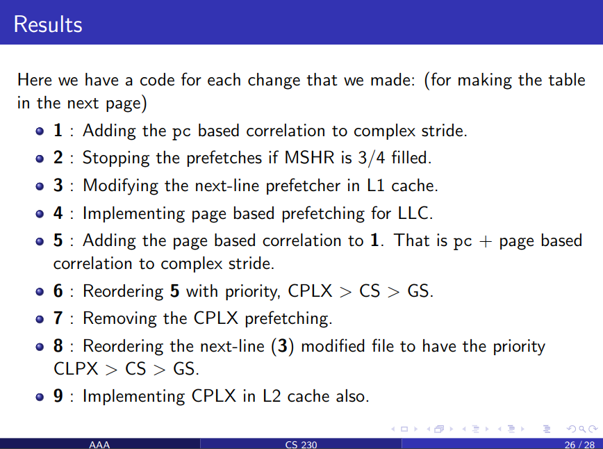

# Improving Data Prefetchers

This is the github repository documenting all the changes that we have made to improve the IPCP prefetcher.

## Link to the Video outlining insights for improving IPCP prefetcher

(Note: The first slide containing the roll numbers did not get recorded in the zoom recording, therefore, we have added it as a thumbnail to the youtube video)

https://www.youtube.com/watch?v=VnOoTxvNDhk

## Details
In this project, we explore improvements in the ipcp prefetcher on 3 fronts:
1. Improving complex stride
2. Page based memory access improvements
3. Miscellaneous improvements

## Implementation

The ```prefetchers``` folder contains all the versions of the ipcp prefetcher (for all the cache levels). The same have been updated in the ```prefetchers``` folder of the Champsim

The following image shows the version number of all the changes that we made and the corresponding changes. The respective files for the 3 levels of the cache are named as:

1. ipcp_<version_number>.l1d_pref
2. ipcp_<version_number>.l2c_pref
3. ipcp_<version_number>.llc_pref




